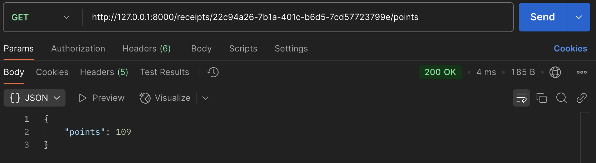
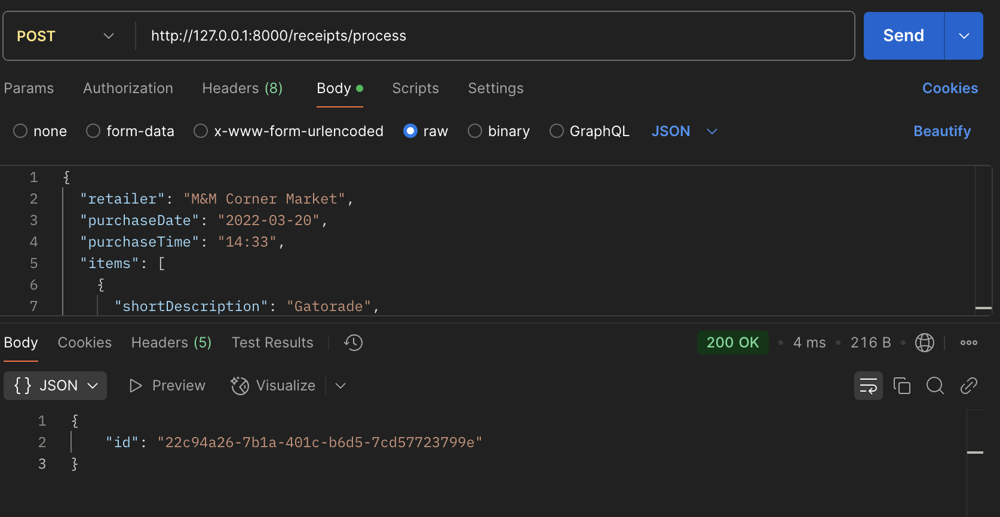

# receipt-processor

This Flask-based web service processes receipt data, calculates reward points based on a set of rules, and provides a REST API to retrieve results. It is built with Python and can be deployed using Docker for ease of use.

## API Test Results

### GET Request Example

### POST Request Example

